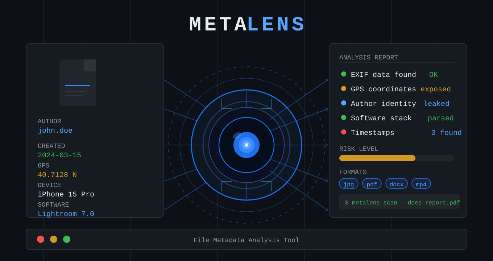

# 🔍 MetaLens

[](../../releases/latest)
[](../../releases)


<p align="center">
  
</p>

**Universal File Metadata Manager** — read, edit, delete and compare metadata across all major file formats, entirely offline.

> [!TIP]
> 💡 **No account, no cloud, no setup.** Download a binary, double-click, and start browsing — MetaLens never touches the network.

---

## 📚 Documentation Index

| 📄 Document                                | 📝 Purpose                                   |
| ------------------------------------------- | -------------------------------------------- |
| [📋 REQUIREMENTS.md](docs/REQUIREMENTS.md) | System requirements and prerequisites        |
| [🚀 INSTALLATION.md](docs/INSTALLATION.md) | Step-by-step installation & build-from-source |
| [📖 USAGE.md](docs/USAGE.md)               | How to use the application                   |
| [📡 API.md](docs/API.md)                   | Sidecar REST API reference for developers    |

---

## ⚡ Quick Start

### 🪟 Windows / 🐧 Linux

1. Grab the latest installer for your platform from [Releases](../../releases)
2. Run it — Windows SmartScreen may warn since the build is unsigned; click **"More info" → "Run anyway"**
3. MetaLens opens with a folder tree on the left — click a folder, then a file, to see its metadata

> ⏱️ **No install wait, no dependency download.** Python and Node.js are bundled into the binary — nothing to set up.

> [!IMPORTANT]
> ✅ For full details, see [INSTALLATION.md](docs/INSTALLATION.md)

---

## 🎯 What It Does

```
File (image / audio / video / document / anything)
         │
         ▼
┌─────────────────────────────────────────────┐
│  🖼️ Images   → EXIF, IPTC, XMP (+ RAW read) │
│  🎵 Audio    → ID3, Vorbis comments, tags   │
│  🎬 Video    → container metadata           │
│  📄 PDF      → document info dictionary     │
│  📊 Office   → DOCX/XLSX/PPTX properties    │
│  📁 Any file → filesystem timestamps,       │
│               permissions, xattr            │
└─────────────────────────────────────────────┘
         │
         ▼
   👁️ View · ✏️ Edit · 🗑️ Delete · ⚖️ Diff · 🔑 Hash
```

---

## ✨ Key Features

- 🗂️ **File-manager UI** — folder tree + file list + metadata detail panel
- 🖼️ **All major formats** — images (JPEG/PNG/TIFF/WebP/RAW), audio (MP3/FLAC/OGG/M4A/WAV), video (MP4/MKV/MOV), documents (PDF/DOCX/XLSX/PPTX/DOC/XLS), and any other file via filesystem metadata
- ✏️ **Full operations** — read, edit, delete individual fields, compare/diff two files
- 🔒 **Atomic writes** — temp-file + rename, no file corruption on failure
- ↩️ **Undo stack** — 50 operations per session
- 🔑 **File integrity hashes** — on-demand MD5 / SHA-1 / SHA-256 / SHA-512 / BLAKE2b with one-click copy
- 🎨 **Cyber dark theme** — professional dark UI with cyan/blue accents
- 📦 **Compiled binaries** — no Python or Node.js required to run
- 💾 **Offline-first** — zero network calls, zero telemetry
- 🆓 **Free & open-source** — MIT license

---

## 🔧 Version

**v0.2.10** — Routine dependency updates (fastapi 0.140.8, lucide-react 1.27.0) plus CI hardening (actions/checkout v7, setup-node v7, setup-python v7, cache v6, codeql-action 4.37.3). No changes to application behavior or the API.

📖 **See full version history** → [CHANGELOG.md](./CHANGELOG.md)

---

## 📋 System Requirements

- **Windows** 10/11 (64-bit) or a modern **Linux** distro (`.deb`/`.rpm`/`.tar.gz`)
- **RAM** 512 MB free
- **Disk** ~300 MB installed
- No Python or Node.js needed to *run* the app — only to build it from source

> [!IMPORTANT]
> ✅ For complete requirements, see [REQUIREMENTS.md](docs/REQUIREMENTS.md)

---

## 🚀 Getting Started

### 1️⃣ Install
Follow [INSTALLATION.md](docs/INSTALLATION.md) for Windows/Linux binaries or building from source.

### 2️⃣ Start Browsing
Learn the interface in [USAGE.md](docs/USAGE.md).

### 💻 For Developers
Explore the sidecar API in [API.md](docs/API.md).

---

## 🗂️ Supported Formats

| Category | Formats | Read | Write |
|---|---|---|---|
| Images | JPEG, PNG, TIFF, BMP, GIF, WebP | ✅ | ✅ |
| Images (RAW) | CR2, NEF, ARW, DNG | ✅ | — |
| Audio | MP3, FLAC, OGG, M4A, WAV, AIFF, WMA, APE, Opus | ✅ | ✅ |
| Video | MP4, MOV | ✅ | ✅ |
| Video | MKV, AVI | ✅ | — |
| Documents | PDF | ✅ | ✅ |
| Office | DOCX, XLSX, PPTX | ✅ | ✅ |
| Office (legacy) | DOC, XLS, PPT | ✅ | — |
| Any file | Filesystem timestamps, permissions, xattr | ✅ | ✅ |
| Other | Hundreds of formats via hachoir | ✅ | — |

### 🔑 File Integrity

Compute cryptographic hashes on demand from the **Metadata** panel — no impact on browsing performance:

| Algorithm | Notes |
|---|---|
| MD5 | Legacy, widely used for checksums |
| SHA-1 | Legacy, used by Git and many tools |
| SHA-256 | Modern standard, recommended |
| SHA-512 | High-security workloads |
| BLAKE2b | Fast modern algorithm, built into Python |

---

## 🏗️ Architecture

| Layer | Technology | Notes |
|---|---|---|
| **Desktop shell** | Electron (Node.js main process) | Spawns the Python sidecar, native menus & dialogs |
| **Renderer UI** | React 19, Vite, TailwindCSS v4 | Folder tree, file list, metadata detail panel |
| **Sidecar** | Python 3.11–3.13, FastAPI, uvicorn | Metadata extraction/write engine, `127.0.0.1` only |

```
Electron Main (Node.js)
    ├── Spawns Python sidecar (FastAPI, localhost only)
    ├── Manages window, native menus, file dialogs
    └── IPC bridge (contextBridge) ↔ React renderer

Python Sidecar (FastAPI)
    ├── /list   — directory listing with handler detection
    ├── /read   — full metadata extraction
    ├── /write  — atomic metadata write-back
    ├── /delete — field removal
    ├── /diff   — metadata comparison
    └── /hash   — on-demand file hashing

React Frontend (Vite + TailwindCSS)
    ├── FolderPanel  — folder tree navigation
    ├── FilePanel    — file list with metadata summary
    └── DetailPanel  — View / Edit / Diff tabs
```

📖 Full endpoint reference → [API.md](docs/API.md)

---

## 📊 Test Suite

✅ **48 automated tests** covering handlers, the handler registry, and path-security validation.

```bash
pytest python/tests/ -v
```

---

## 🔐 Privacy & Security

- 🛡️ **No cloud dependencies** — everything runs locally
- 🔒 **No telemetry** — zero data collection
- 📁 **Localhost-only sidecar** — the Python API never binds beyond `127.0.0.1`
- 🔓 **Open source** — fully auditable code
- ⚡ **Fully offline** — no internet connection required, ever

📖 See [SECURITY.md](./SECURITY.md) for the full security model.

---

## 🤝 Contributing

Contributions are welcome! Please:

1. Fork the repository
2. Create a feature branch (`git checkout -b feature/your-feature`)
3. Commit changes with clear messages
4. Push to your fork
5. Open a Pull Request to `develop` branch

📖 See [CONTRIBUTING.md](./CONTRIBUTING.md) for the full guide.

> [!NOTE]
> 📖 All PRs should target the **`develop`** branch, not `main`.

---

## 📜 License

Distributed under the **MIT License**. See [LICENSE](LICENSE) for details.

---

## 🙋 Support

- 📖 **Documentation:** See [docs/](docs/) folder
- 🐛 **Report issues:** [GitHub Issues](https://github.com/overwrite00/MetaLens/issues)
- 💬 **Questions:** Open a [GitHub Discussion](https://github.com/overwrite00/MetaLens/discussions)

---

## 👨‍💻 Credits

Developed by **Graziano Mariella**

Distributed with MIT License · [View License](LICENSE)

---

*Last updated: 2026-07-31*
*← [Requirements](docs/REQUIREMENTS.md) | [Docs →](docs/)*
